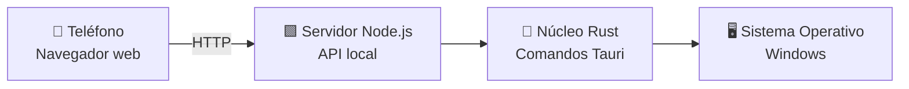

<div align="center">

# 📱 Escritorio en Mano

**Controla tu PC desde el teléfono con una app de escritorio ligera y moderna**

[]()
[]()
[]()
[]()
[]()
[]()
[](https://opensource.org/licenses/MIT)

Llevá tu PC en el bolsillo. Desde el teléfono podés apagar, reiniciar, bloquear, ajustar el volumen o abrir tus apps favoritas, sin moverte del sillón.

</div>

---

## 📋 Tabla de contenidos

- [¿Qué es?](#-qué-es)
- [¿Cómo funciona?](#-cómo-funciona)
- [Características](#-características)
- [Tecnologías](#-tecnologías)
- [Instalación y uso](#-instalación-y-uso)
- [Estructura del proyecto](#-estructura-del-proyecto)
- [Arquitectura](#-arquitectura)
- [Configuración](#-configuración)
- [Autores](#-autores)
- [Licencia](#-licencia)

---

## 🧐 ¿Qué es?

**Escritorio en Mano** es una aplicación de escritorio para Windows construida con Tauri que transforma tu teléfono en un control remoto para tu PC. La app corre en la **bandeja del sistema** de forma silenciosa y expone un servidor HTTP local (Node.js) al que te conectás desde cualquier navegador del teléfono — siempre y cuando ambos estén en la misma red.

Una vez conectado, podés ejecutar acciones del sistema desde la interfaz React optimizada para móvil: apagar, reiniciar, bloquear sesión, controlar volumen, abrir programas y más, todo con una interfaz "cristal oscuro" animada.

---

## ⚙️ ¿Cómo funciona?

El sistema se compone de tres actores que conversan de forma silenciosa: el frontend web que se sirve al teléfono, el servidor Node.js que actúa como puente, y el núcleo Rust que ejecuta las acciones sobre el sistema.



**Secuencia:**

1. Al iniciar, la app se registra como instancia única vía **Single-Instance Plugin** de Tauri y se aloja en la **bandeja del sistema**.
2. El servidor **Node.js** levanta una API HTTP en la red local y muestra la URL a la que conectarte desde el teléfono.
3. El frontend **React** se sirve como interfaz web responsiva, optimizada para pantallas de teléfono.
4. Cuando tocás una acción en el teléfono, la petición llega al servidor Node.js, que invoca los **comandos Tauri** del núcleo Rust.
5. El núcleo Rust ejecuta la acción real sobre Windows (apagar, bloquear, volumen, abrir app…).
6. El estado del sistema (nivel de batería, volumen, etc.) se devuelve al teléfono y se anima con Framer Motion.

---

## ✨ Características

- **📱 Control desde el teléfono:** No necesitás instalar nada — cualquier navegador del teléfono sirve, siempre que esté en la misma red.
- **🖥️ Acciones del sistema:** Apagar, reiniciar, suspender, bloquear sesión, cerrar sesión y más.
- **🔊 Control de medios:** Subí y bajá el volumen, silenciá o reproducí/pausá la música desde el teléfono.
- **🚀 Lanzador de apps:** Abrí programas o archivos con un toque (configurable).
- **🔐 Seguridad de acceso:** PIN o token de autenticación para que solo vos controles tu PC.
- **🪟 Interfaz Cristal Oscuro:** Ventana transparente con efecto acrílico de Windows, glassmorphism y transiciones animadas.
- **🌙 Modo Bandeja:** Cerrar la ventana la oculta a la bandeja; el servidor sigue activo en segundo plano.
- **🔐 Instancia Única:** Impide procesos duplicados; si ya hay uno corriendo, enfoca la ventana existente.
- **⚙️ Configuración en Vivo:** Acciones, token de acceso y puerto editables desde la interfaz y guardados en `config.json`.

---

## 🛠️ Tecnologías

| Tecnología | Versión | Rol |
|------------|---------|-----|
| Tauri | 2.x | Framework de escritorio (Rust + WebView2) |
| Rust | 1.97+ | Comandos del sistema, WinAPI y bandeja |
| Node.js | 20.x+ | Servidor HTTP local que conecta teléfono y PC |
| React | 18.x | Interfaz web servida al teléfono |
| TypeScript | 5.x | Tipado del frontend y del servidor |
| Vite | 6.x | Dev server y build del frontend |
| Framer Motion | 12.x | Animaciones fluidas |
| windows crate | 0.58 | WinAPI: volumen, energía, control de sesión |
| express | 4.x | API REST del servidor local |

---

## 🚀 Instalación y uso

**Requisitos:**
- Windows 10/11
- [Rust (rustup)](https://rustup.rs/) y [Node.js](https://nodejs.org/)
- WebView2 (incluido en Windows 11)
- El teléfono y la PC conectados a la **misma red WiFi**

**Desarrollo:**

```bash
# 1. Instalar dependencias del frontend y del servidor
npm install

# 2. Ejecutar en modo desarrollo (ventana + hot reload)
npm run tauri dev
```

**Producción (instalador NSIS):**

```bash
npm run tauri build
```

El instalador queda en `src-tauri/target/release/bundle/nsis/`. La primera ejecución crea `config.json` junto al ejecutable con el token de acceso, el puerto del servidor y las acciones configuradas.

**💡 Uso desde el teléfono:**

1. Iniciá la app en tu PC.
2. Tocá en la interfaz para ver la URL local (ej: `http://192.168.1.23:8080`).
3. Abrí esa dirección en el navegador del teléfono.
4. Ingresá el PIN y listo: controlás la PC desde la palma de tu mano.

---

## 📁 Estructura del proyecto

```
📦 escritorio-en-mano/
├── 📂 src/                       # Frontend React + TypeScript
│   ├── 📂 components/            # Sidebar, Topbar, ControlView, ConfigView...
│   │   └── 📂 views/             # PanelView, ConfigView, AyudaView
│   ├── 📂 hooks/                 # useControl (fetch + eventos Tauri)
│   ├── 📄 App.tsx                # Orquestación + transiciones
│   ├── 📄 types.ts               # EstadoSistema, Accion, Config
│   └── 📄 styles.css             # Design system "cristal oscuro"
├── 📂 server/                    # Servidor Node.js (puente teléfono ↔ PC)
│   ├── 📄 index.ts               # API HTTP local + autenticación por token
│   └── 📄 routes.ts              # Endpoints: /acciones, /estado, /volumen...
├── 📂 src-tauri/                 # Backend Rust
│   ├── 📂 src/
│   │   ├── 📄 lib.rs             # Comandos, bandeja, single-instance, acrílico
│   │   ├── 📄 system.rs          # Acciones: apagar, bloquear, volumen, abrir apps
│   │   ├── 📄 winapi.rs          # Control de volumen, energía y sesión
│   │   ├── 📄 config.rs          # Carga/guardado de config.json
│   │   └── 📄 main.rs
│   ├── 📂 icons/                 # Íconos de la app
│   └── 📄 tauri.conf.json        # Configuración de la ventana y del bundle
├── 📄 config.json                # Token, puerto y acciones (gitignored)
├── 📄 .gitignore
├── 📄 LICENSE
└── 📄 README.md
```

---

## 🏗️ Arquitectura

El flujo de control va siempre en la misma dirección: el teléfono pide, Node.js traduce, Rust ejecuta.

```mermaid
sequenceDiagram
    participant P as 📱 Teléfono (navegador)
    participant N as 🟩 Servidor Node.js
    participant T as 🦀 Núcleo Rust (Tauri)
    participant W as 🖥️ Windows

    P->>N: POST /api/accion { token, accion: "apagar" }
    N->>N: ¿Token válido?
    N->>T: invoke("apagar_sistema")
    T->>W: ExitWindowsEx()
    W-->>T: OK
    T-->>N: Respuesta JSON
    N-->>P: { status: "ok" }

    rect rgb(30, 30, 30)
        Note over P,W: Estado en vivo
        P->>N: GET /api/estado
        N->>T: invoke("estado_sistema")
        T->>W: GetSystemPowerStatus()
        W-->>T: { percent, plugged }
        T-->>N: JSON
        N-->>P: { bateria: 82%, volumen: 40 }
    end
```



---

## 🔌 Configuración

Toda la configuración se guarda en `config.json`, generado en la primera ejecución:

| Variable | Descripción | Valor por defecto |
|----------|-------------|-------------------|
| `access_token` | PIN o token para autenticar el teléfono | generado al azar |
| `port` | Puerto del servidor HTTP local | `8080` |
| `host` | IP en la que escucha el servidor | `0.0.0.0` |
| `actions` | Lista de acciones y apps disponibles en el panel | `[]` |
| `autostart` | Iniciar con Windows | `false` |

### 🛠️ Snippet de Configuración

```json
{
  "access_token": "1234",
  "port": 8080,
  "host": "0.0.0.0",
  "actions": [
    { "id": "shutdown", "label": "Apagar PC", "icon": "power", "confirm": true },
    { "id": "restart", "label": "Reiniciar", "icon": "restart", "confirm": true },
    { "id": "lock", "label": "Bloquear", "icon": "lock", "confirm": false },
    { "id": "open", "label": "Spotify", "icon": "music", "path": "C:\\Program Files\\Spotify\\Spotify.exe" }
  ],
  "autostart": false
}
```

---

## 👥 Autores

**TiagoM395**

Pull requests y reportes de issues son siempre bienvenidos.

## 📄 Licencia

Distribuido bajo la Licencia MIT. Podés utilizar, modificar y distribuir este software de forma libre en proyectos personales o comerciales.
